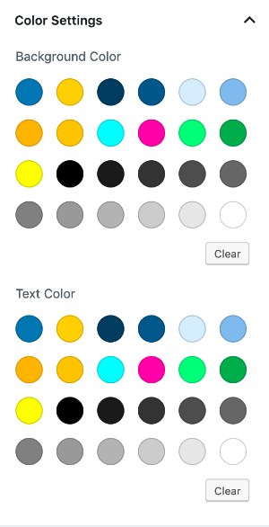

# UCLA Theme Custom Color Palette
Add UCLA Theme Color Palette to the Gutenberg Block Editor for WordPress

The Gutenberg editor provides a default palette but a theme can overwrite it and provide its own. 

Simply add the code in this repository's `functions.php` to `functions.php` in your WordPress theme or child theme to load the UCLA color palette and remove the default custom color palette. 

## Screenshot
  

## Sample code

```

function ucla_palette_gutenberg_custom_colors(){

	// Disable the custom color picker.
	add_theme_support( 'disable-custom-colors' );

	// Add the UCLA color palette
	add_theme_support( 'editor-color-palette', array(
		array(
			'name'  => __( 'UCLA Blue', 'template-a' ),
			'slug'  => 'ucla-blue',
			'color'	=> '#2774ae',
		),
		array(
			'name'  => __( 'UCLA Gold', 'template-a' ),
			'slug'  => 'ucla-gold',
			'color' => '#ffd100',
		),
		array(
			'name'  => __( 'Darkest Blue', 'template-a' ),
			'slug'  => 'ucla-darkest-blue',
			'color' => '#003b5c',
		),
		array(
		'name'  => __( 'Darker Blue', 'template-a' ),
		'slug'  => 'ucla-darker-blue',
		'color' => '#005587',
		),
		array(
			'name'  => __( 'Lightest Blue', 'template-a' ),
			'slug'  => 'ucla-lightest-blue',
			'color' => '#daebfe',
		),					 
		array(
			'name'  => __( 'Lighter Blue', 'template-a' ),
			'slug'  => 'ucla-lighter-blue',
			'color' => '#8bb8e8',
		),
		array(
			'name'  => __( 'Darkest Gold', 'template-a' ),
			'slug'  => 'ucla-darkest-gold',
			'color' => '#ffb81c',
		),
		array(
			'name'  => __( 'Darker Gold', 'template-a' ),
			'slug'  => 'ucla-darker-gold',
			'color' => '#ffc72c',
		),
		array(
			'name'  => __( 'Cyan', 'template-a' ),
			'slug'  => 'ucla-cyan',
			'color' => '#0ff',
		),
		array(
			'name'  => __( 'Magenta', 'template-a' ),
			'slug'  => 'ucla-magenta',
			'color' => '#ff00a5',
		),
		array(
			'name'  => __( 'Green', 'template-a' ),
			'slug'  => 'ucla-green',
			'color' => '#00ff87',
		),
		array(
			'name'  => __( 'Chateau Green', 'template-a' ),
			'slug'  => 'ucla-chateau-green',
			'color' => '#32aa56',
		),
		array(
			'name'  => __( 'Yellow', 'template-a' ),
			'slug'  => 'ucla-yellow',
			'color' => '#ff0',
		),
		array(
			'name'  => __( 'Black', 'template-a' ),
			'slug'  => 'ucla-black',
			'color' => '#00',
		),
		array(
			'name'  => __( 'Black 90%', 'template-a' ),
			'slug'  => 'ucla-black-90',
			'color' => '#1a1a1a',
		),
		array(
			'name'  => __( 'Black 80%', 'template-a' ),
			'slug'  => 'ucla-black-80',
			'color' => '#333',
		),
		array(
			'name'  => __( 'Black 70%', 'template-a' ),
			'slug'  => 'ucla-black-70',
			'color' => '#4d4d4d',
		),
		array(
			'name'  => __( 'Black 60%', 'template-a' ),
			'slug'  => 'ucla-black-60',
			'color' => '#666',
		),
		array(
			'name'  => __( 'Black 50%', 'template-a' ),
			'slug'  => 'ucla-black-50',
			'color' => '#808080',
		),
		array(
			'name'  => __( 'Black 40%', 'template-a' ),
			'slug'  => 'ucla-black-40',
			'color' => '#999',
		),
		array(
			'name'  => __( 'Black 30%', 'template-a' ),
			'slug'  => 'ucla-black-30',
			'color' => '#b3b3b3',
		),
		array(
			'name'  => __( 'Black 20%', 'template-a' ),
			'slug'  => 'ucla-black-20',
			'color' => '#ccc',
		),
		array(
			'name'  => __( 'Black 10%', 'template-a' ),
			'slug'  => 'ucla-black-10',
			'color' => '#e6e6e6',
		),
		array(
			'name'  => __( 'White', 'template-a' ),
			'slug'  => 'ucla-white',
			'color' => '#fff',
		),
						
	) );
}

add_action( 'after_setup_theme', 'ucla_palette_gutenberg_custom_colors' );

```
